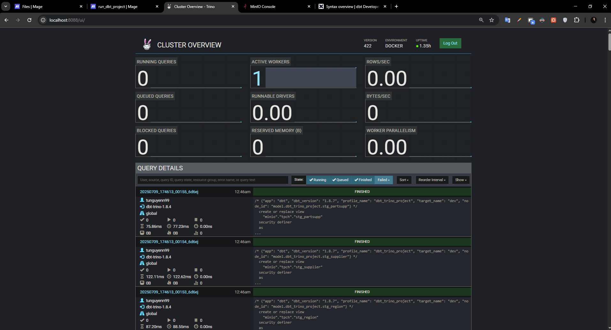
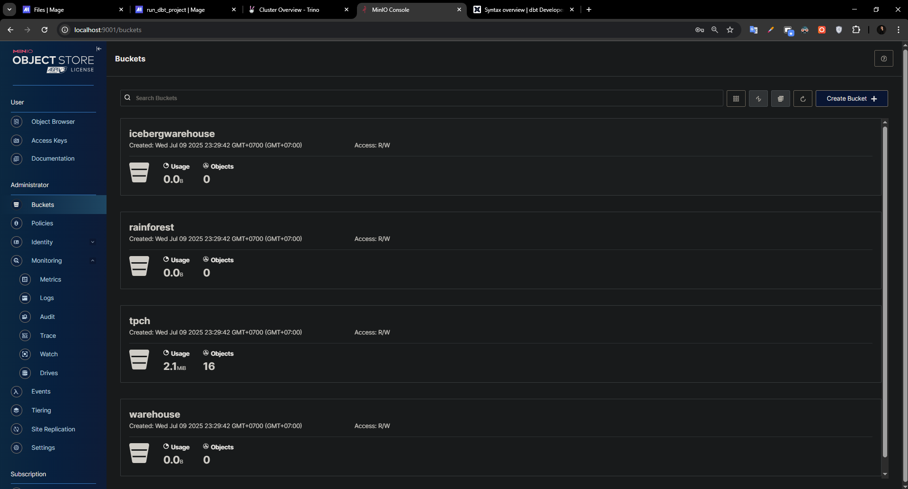
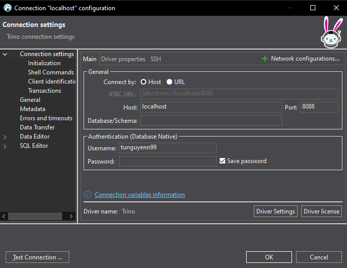
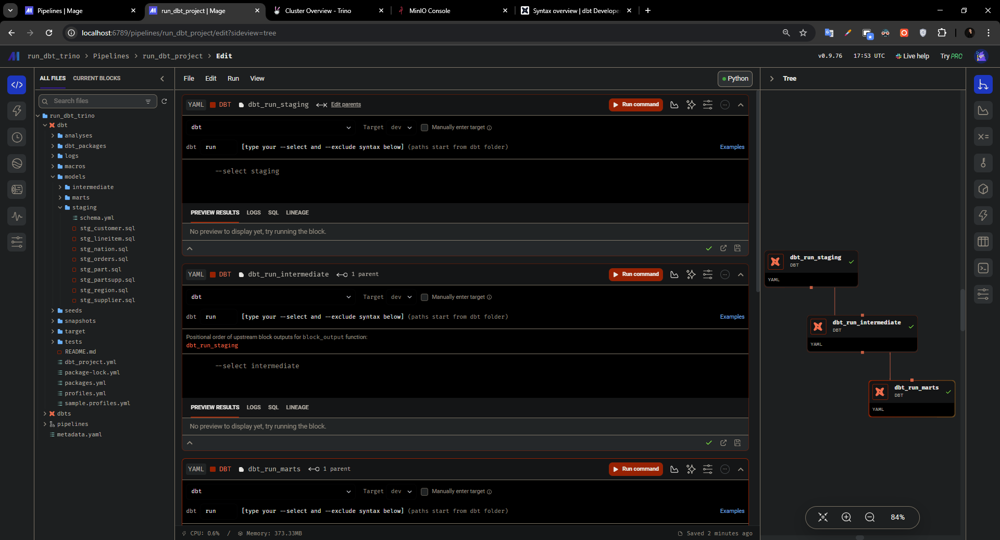
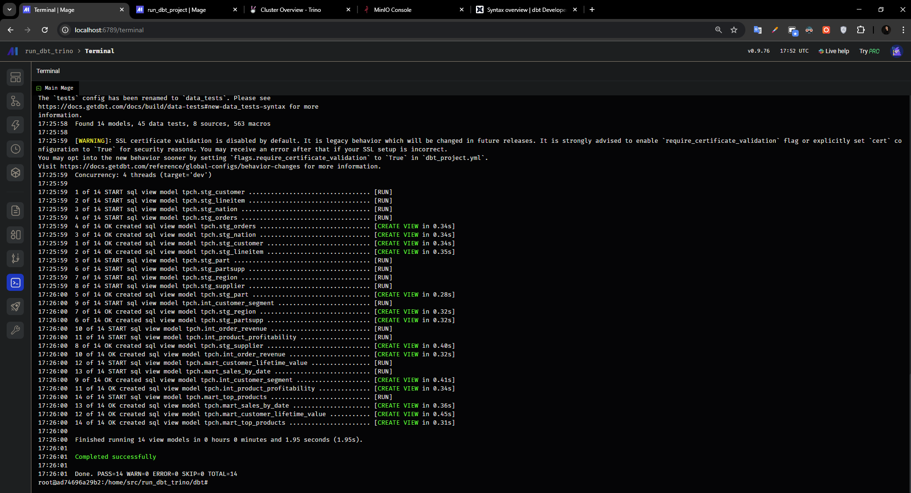
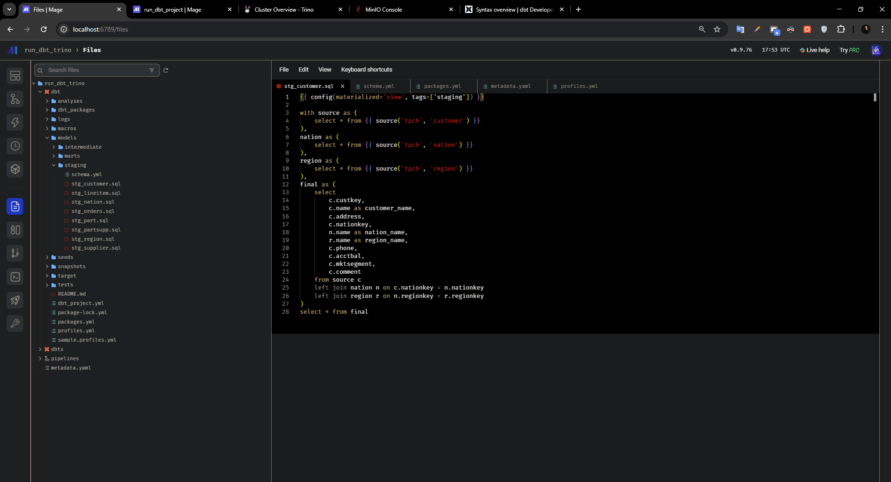
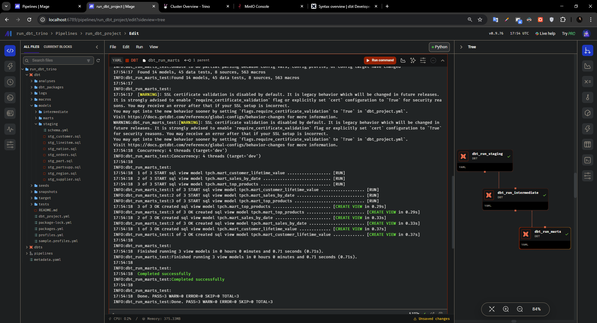
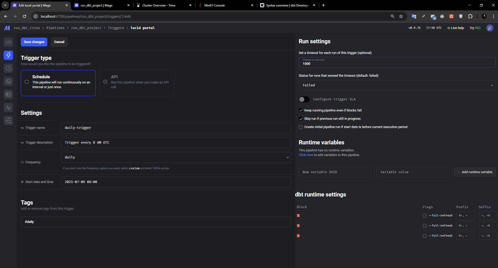
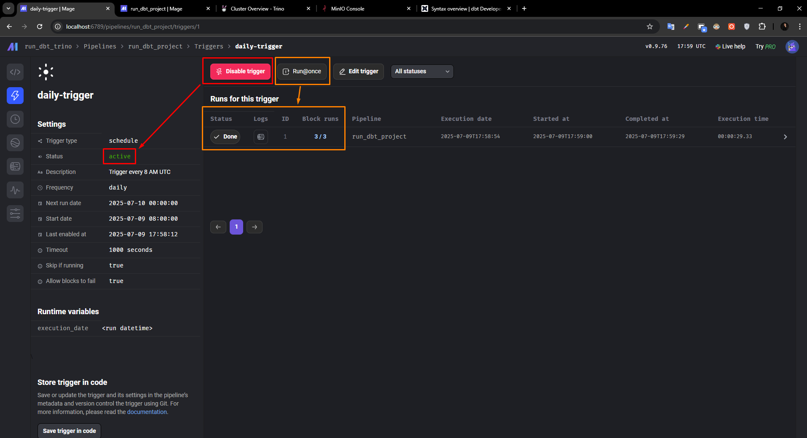
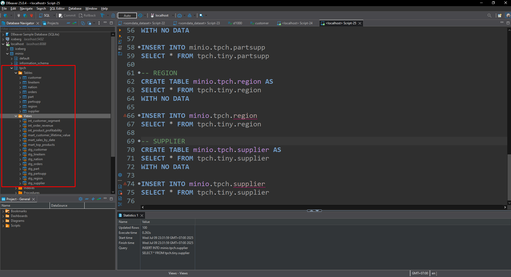

# 🧊 DBT + Trino + MinIO + Iceberg – Data Lakehouse Dev Stack

Dự án này thiết lập một môi trường phát triển đầy đủ cho Data Lakehouse sử dụng Trino, Iceberg, MinIO và DBT, kèm theo công cụ orchestrator Mage để quản lý pipelines.

---

## 📂 Cấu trúc thư mục dự án

```
dbt-trino-minio-iceberg-mage/
├── conf/                           # Cấu hình Hive Metastore
│   └── core-site.xml
│   └── metastore-site.xml
├── containers/                    # Dockerfile khởi tạo bucket MinIO
│   └── setup/
│       └── Dockerfile
│       └── create_buckets.py      # Khởi tạo bucket
├── dbt_trino_project/             # Dự án DBT: staging → marts
│   ├── models/
│   ├── macros/
│   └── dbt_project.yml            # Sử dụng cho Mage
├── images/                        # Ảnh minh hoạ cho README
├── mage-quickstart/               # Mage orchestrator pipeline
│   ├── docker-compose.yml
│   └── Dockerfile
├── run-trino-sql/                 # SQL mẫu tạo bảng Iceberg
│   └── create-table-in-minio.sql
├── .env
├── docker-compose.yml             # Compose khởi chạy toàn bộ hệ thống
├── Makefile                       # Tập lệnh khởi tạo nhanh
└── README.md
```

---

## 🧠 Giới thiệu công nghệ sử dụng

Dự án này mô phỏng một **Data Lakehouse stack hiện đại** với đầy đủ các thành phần từ ingestion đến semantic modeling, cụ thể:

| Thành phần        | Mô tả chức năng chính |
|------------------|------------------------|
| **Trino**        | Mạnh mẽ trong xử lý truy vấn phân tán, hỗ trợ truy cập dữ liệu từ Iceberg thông qua SQL chuẩn |
| **Apache Iceberg** | Table format hiện đại, hỗ trợ schema evolution, ACID, time travel, phân vùng thông minh |
| **MinIO**        | Object Storage mô phỏng S3, nơi lưu trữ dữ liệu thực tế (dữ liệu raw, staging, marts) |
| **Hive Metastore** | Quản lý metadata cho Iceberg table (thông qua Trino) |
| **MariaDB**      | Backend cho Hive Metastore |
| **DBT (Data Build Tool)** | Quản lý logic biến đổi dữ liệu với khả năng modular hóa, test, và lineage |
| **Mage**         | Orchestrator giao diện UI, hỗ trợ chạy pipeline DBT định kỳ hoặc theo sự kiện |

> 📌 Tổng thể, dự án giúp trải nghiệm toàn bộ vòng đời của một hệ thống phân tích dữ liệu quy mô lớn:  
> Từ lưu trữ dữ liệu → xử lý truy vấn hiệu năng cao → mô hình hóa dữ liệu → triển khai pipeline trực quan.

---

# **A. Chuẩn bị Git & Docker**

## 🧰 Cần chuẩn bị những gì?

1. [Git >= 2.37.1](https://github.com/git-guides/install-git)
2. [Docker >= 20.10.17](https://docs.docker.com/engine/install/) và [Docker Compose v2 >= 2.10.2](https://docs.docker.com/compose/)

### 💡 Nếu bạn dùng Windows:
- Cài **WSL** + Ubuntu: [Xem repo sau (có video hướng dẫn)](https://github.com/tunguyenn99/ubuntu-install-wsl)
- Cài Docker bên trong Ubuntu (nếu chưa có thì xem [bài viết này](https://www.digitalocean.com/community/tutorials/how-to-install-and-use-docker-on-ubuntu-22-04#step-1-installing-docker) hoặc [repo sau](https://github.com/tunguyenn99?tab=repositories&q=docker&type=&language=&sort=))
- Cài thêm `make` bằng lệnh:

```bash
sudo apt install make -y
```

---

## 📥 Tải về mã nguồn

```bash
git clone https://github.com/tunguyenn99/dbt-trino-minio-iceberg-mage.git
cd dbt-trino-minio-iceberg-mage
```

---

# **B. Cài đặt Trino - Minio**

## 🐳 Khởi động môi trường làm việc

```bash
# Kiểm tra Docker đang chạy
docker ps

# Khởi chạy toàn bộ container
make up

# Nếu có lỗi, xóa toàn bộ container bằng:
# docker rm -f $(docker ps -a -q)

# Chờ khoảng 60 giây để hệ thống sẵn sàng
sleep 60

# Mở giao diện dòng lệnh Trino
make trino
```

---

## 🌐 Truy cập giao diện Web

| Giao diện | URL |
|----------|-----|
| Trino UI | [http://localhost:8080](http://localhost:8080) |
| MinIO UI | [http://localhost:9001](http://localhost:9001) – user: `minio`, pass: `minio123` |





---

## 🧪 Thử truy vấn Trino với bộ dữ liệu TPC-H

```sql
-- Gõ trong CLI của Trino:
USE tpch.tiny;
SHOW tables;
SELECT * FROM orders LIMIT 5;
exit;
```

📦 Trino có sẵn nhiều bộ dữ liệu mẫu theo các mức độ lớn nhỏ: `tiny`, `sf1`, `sf100`, v.v.

---

## 🗺️ Mô hình dữ liệu TPC-H

Bộ dữ liệu TPC-H mô phỏng một doanh nghiệp bán linh kiện xe hơi gồm:

- Đơn hàng (orders)
- Sản phẩm trong đơn (lineitem)
- Khách hàng, nhà cung cấp
- Quốc gia, vùng lãnh thổ, sản phẩm...


---

# **C. Cài đặt DBeaver**

## 🖥️ Kết nối Trino bằng DBeaver (tùy chọn)

1. Tải [DBeaver tại đây](https://dbeaver.io/)
2. Vào `Database` → `New Database Connection`
3. Chọn `Trino` → Next
4. Để nguyên cấu hình mặc định → thay đổi port là `8088` → Nhập user là `tunguyenn99`
5. Test connection → Finish



---

# **D. Cài đặt DBT**

## 🛠️ Thiết lập DBT sau khi tạo bảng Iceberg

Sau khi bạn đã chạy lệnh `make up`, kiểm tra UI và tạo bảng thành công bằng các câu lệnh SQL có sẵn, bạn có thể bắt đầu khởi tạo DBT project như sau:

### 1. Chạy file tạo bảng Iceberg bằng DBeaver

Mở DBeaver, kết nối Trino (port 8088, user tùy ý), sau đó mở file:

```
run-trino-sql/create-table-in-minio.sql
```

Chạy toàn bộ lệnh SQL trong đó để tạo bảng Iceberg trong bucket MinIO.

---

### 2. Cài đặt DBT và adapter Trino

```bash
pip install dbt-core dbt-trino
```

> Yêu cầu Python >= 3.8

---

### 3. Khởi tạo DBT project mới

```bash
dbt init dbt_trino_project
```

- Chọn adapter: `trino`
- DBT sẽ sinh ra các file như `models/`, `dbt_project.yml`,...

---

### 4. Tạo file cấu hình `profiles.yml`

```yaml
dbt_trino_project:
  outputs:
    dev:
      type: trino
      method: none
      user: tunguyenn99
      password: ''
      database: minio
      host: localhost  # nếu chạy trong Mage → đổi thành 'trino-coordinator'
      port: 8088
      schema: tpch
      threads: 4

    prod:
      type: trino
      method: none
      user: tunguyenn99
      password: ''
      database: minio
      host: localhost
      port: 8088
      schema: tpch
      threads: 4

  target: dev
```

> Nếu chạy trong Mage, `host: trino-coordinator` là bắt buộc.

---

### 5. Kiểm tra kết nối

```bash
dbt debug
```

---

### 6. Một số lệnh DBT thường dùng

```bash
dbt run
dbt build
dbt test
dbt run --select tag:staging
```

---

# **D. Cài đặt Mage**

## 🧙 Mage Quickstart – Tích hợp với `dbt_trino_project`

Đây là hướng dẫn từng bước để tích hợp Mage vào dự án `dbt_trino_project`.



### 1. Clone Mage Template

```bash
git clone https://github.com/mage-ai/compose-quickstart.git mage-quickstart \
&& cd mage-quickstart \
&& cp dev.env .env && rm dev.env
```

### 2. Cấu hình `.env` trong đó đặt tên project vào môi trường dev

```env
PROJECT_NAME=run_dbt_trino 
ENV=dev
```

### 3. Mount DBT project + network

Trong `mage-quickstart/docker-compose.yml`, thêm:

```yaml
volumes:
  - .:/home/src/
  - ../dbt_trino_project:/home/src/run_dbt_trino/dbt/ #Mount thẳng project dbt local vào folder dbt trong project run_dbt_trino của Mage

networks:
  - trino-network

networks:
  trino-network:
    external: true
    name: dbt-trino-minio-iceberg_trino-network
```

> ⚠️ Đảm bảo `name:` đúng với tên Docker network mà Trino đang chạy.

---

### 📄 Lưu ý về `profiles.yml` trong `dbt_trino_project` được mount vào

```yaml
dbt_trino_project:
  outputs:
    dev:
      type: trino
      method: none
      user: tunguyenn99
      password: ''
      database: minio
      host: trino-coordinator # <<== Đổi localhost sau khi kết nối mạng với trino (chi tiết trong README.md của folder mage-quickstart)
      port: 8088
      schema: tpch
      threads: 4
  target: dev
```

---

### 4. Chạy Mage

```bash
docker compose up --build
```

→ Truy cập Mage UI tại: [http://localhost:6789](http://localhost:6789)




---

### 5. Tạo pipeline và block DBT

- Một số thông tin: 
    
    + **DBT Project Path**: `/home/src/run_dbt_trino/dbt`
    
    + **Profiles Path**: `/home/src/run_dbt_trino/dbt`
    
    + **Command**: `run`, `build`, `test`
    
    + **Flags**: `--select dbt/models/staging` hoặc `--select tag:staging`

- Ví dụ việc setup Pipeline trong Mage:

**Bước 1**: Tạo Pipeline thông qua tạo các blocks dạng `DBT`. Lưu ý chọn folder project `dbt` trong giao diện UI, điền flag `--select staging` ,  `--select intermediate` và  `--select marts` với từng blocks:


**Bước 2**: Ấn `Run command` với từng block để test xem block có hoạt động không:



**Bước 3**: Khi các block hoạt động, save lại Pipeline và tạo `Trigger` dạng `Schedule` với các thông tin ví dụ như ảnh:



**Bước 4**: Chọn `Enable Trigger` và chọn run 1 lần để test thử scheduled pipeline. Kết quả như ảnh là **thành công**:



---

## 📦 Kết quả 

- Trong project này, mình để hoàn toàn 100% các bảng ở dạng materialized là `view`:



---

# **E. Tổng kết**

- 🚀 Dựng được Trino + Iceberg + MinIO + DBT + Hive chỉ với `make up`
- ✅ Có sẵn dataset mẫu TPC-H để thử nghiệm
- 🧙 Orchestrate với Mage + chạy pipeline trực quan
- 🔧 Phù hợp học, demo hoặc khởi đầu production

---

📫 Nếu bạn thấy hữu ích, hãy ⭐ repo này và góp ý nhé!

> ⭐ Author: @tunguyenn99